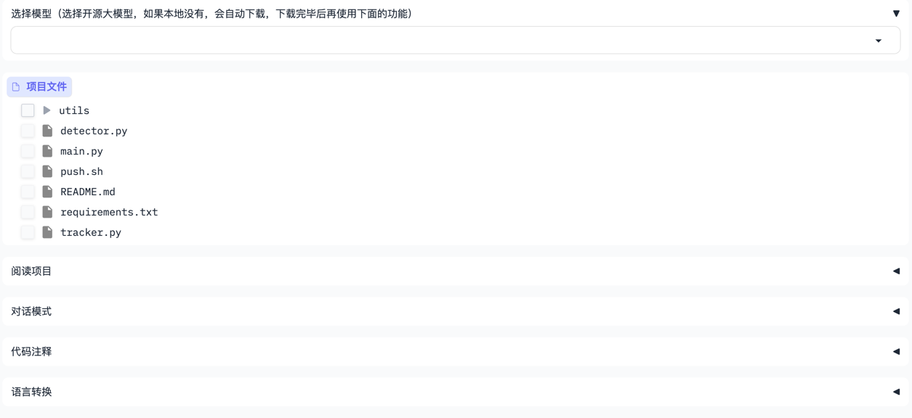

# 项目阅读助手

欢迎大家关注我的公众号**渡码**，大家使用过程中遇到问题，可以在公众号向我提问。AI相关项目、优秀资料都会在公众号首发。

**公众号回复`key`获取免费共享的`chatgpt api key`国内直接用，免魔法**



### 安装依赖

python 版本需要 3.10 或以上

如果用 ChatGPT，执行下面命令安装依赖包
```shell
pip install -r requirements.txt
```

如果用开源大模型，在`llms`目录安装对应的依赖，如：`ChatGLM3`执行
```shell
pip install -r llms/requirements_chatglm3.txt
```

### 修改配置文件

项目根目录下有个`.env.tpl`模板配置文件。将其重命名文`.env`文件，修改里面的配置项即可。

每个配置项在文件里都有详细说明，按照说明配置即可。

如果你想接入自己的大模型，在`llms`目录中自定义一个类，继承`LLM`类，实现`request`函数即可。

### 运行

```shell
python main.py
```

### 注意事项

1. 关于模型选择，3.5和4.0都可以，我在视频演示用的是3.5(gpt-3.5-turbo-1106)
2. 模型上下文最好在 16k 以上，因为有些源文件比较大，上下文太小可能长度不够
3. 把非源代码的文件删掉，如：压缩文件、图片、模型权重等。阅读这些文件无意义，可能产生不必要的报错，甚至浪费你的api额度
4. **关注你的api额度**，一上来尽量不要读文件多、文件大的项目，建议先用小项目试试，关注一下api额度消耗情况。

这个小项目还有很多不完善的地方，欢迎大家提出改进意见，也欢迎大家提交代码

Bilibili：https://space.bilibili.com/494605864

微信公众号：[渡码](http://mp.weixin.qq.com/profile?src=3&timestamp=1663979948&ver=1&signature=wcyNF3yu1W0bMvEanLaDxbZWIzr4fHOGzS3*iP9FBJmGgREoKU6rifDbYefvfJNkEK2r*hS6httmcHBrvtFoVg==)


